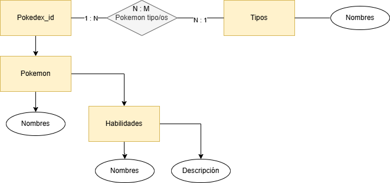
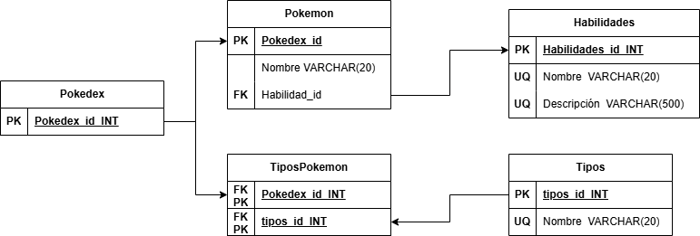

# Pokedex

Pokedex chiquita

## Tabla principal

* Pokedex_id(PK)

---

## Tabla pokemon

* Pokedex_id(FK)(PF)

* Nombres (UQ)

* Habilidades_id(FK)

---

## Tabla tipos

1. tipos_id(PK)
1. Nombre (UQ)

## Tabla habilidades

1. Habilidades_id(PK)
1. Nombre (UQ)
1. Descripción (UQ)

## Tabla Pibote tipos y pokemon

1. Pokemon_id(FK)(PK)
1. tipos_id(FK)(PK)

## Modelo entidad relación

## Modelo Relacional de la base de datos

